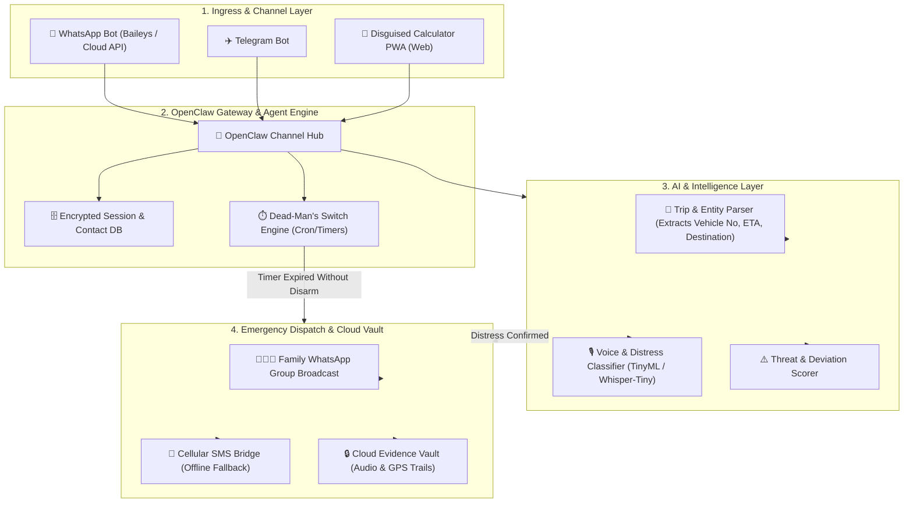
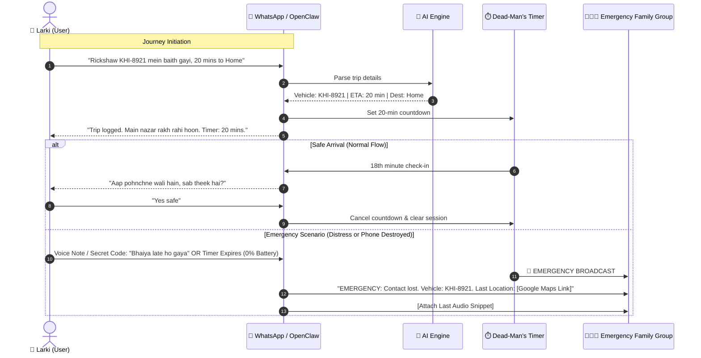

# 🛡️ Project Hifazat (Beti Guard AI)
> **Executive Pitch, Product Requirements Document (PRD) & Technical Specification**
> *An Open-Source, Zero-Install, Autonomous AI Safety Ecosystem for Women & Families*

---

# 🚀 PART 1: THE EXECUTIVE PITCH

### 📌 1. Tagline & One-Liner
> **"Turning every smartphone into an autonomous, zero-touch guardian that protects women without requiring new apps, battery drain, or manual button presses."**

---

### 🚨 2. The Problem: Why Current Solutions Fail
In South Asia and across the world, millions of women feel vulnerable during daily commutes, rideshares, and walking alone. While hundreds of "SOS safety apps" exist on app stores, **over 95% fail in real-life crises** due to four fatal flaws:

1. **The "Unlock & Press" Delusion:** In a real attack or kidnapping scenario, a victim cannot unlock her phone, navigate to an app, and hold an SOS button. The phone is often snatched or dropped in seconds.
2. **Alarm Fatigue & False Triggers:** Primitive sound detectors trigger on car horns, laughter, and city noise, sending false alarms to parents until the app is angrily uninstalled.
3. **Severe Battery Drain & Background Killing:** Continuous GPS/Mic listening drains mobile batteries in 2–3 hours. Android/iOS aggressively kill background processes.
4. **The "Dead Phone" Vulnerability:** If an attacker smashes the phone or the battery drops to 0%, all existing tracking apps go completely silent.

---

### 💡 3. The Solution: Project Hifazat
**Project Hifazat** is an autonomous safety engine built on **OpenClaw** that interfaces through everyday channels like **WhatsApp, Telegram, and a Camouflaged Web PWA**.

* 🟢 **Zero App Download (WhatsApp Native):** Users interact directly through WhatsApp. No downloads required for the user or their family members.
* 🎙️ **Hands-Free AI Voice & Distress Trigger:** A 3-tier lightweight audio AI listens for genuine panic screams and secret conversational distress phrases (e.g., *"Bhaiya late ho raha hai"*).
* ⏱️ **Server-Side "Dead-Man's Switch":** If a user starts a 20-minute trip and the phone is destroyed or dies, the cloud server automatically sounds the alarm to the family with vehicle info and last known coordinates.
* 🔋 **Ultra-Low Battery (Sleep-First Architecture):** Consumes less than 3% battery per day by keeping the CPU in deep sleep until acoustic spikes occur.
* 🎭 **Stealth Camouflage PWA:** A secondary zero-install web tool disguised as a standard Calculator with secret PIN panic triggers.
* 🔒 **100% Free & Privacy-First:** Fully self-hosted on OpenClaw with end-to-end encrypted evidence logging.

---

### 📊 4. Competitive Matrix

| Feature | Regular SOS Apps | bSafe / Noonlight | Project Hifazat (Ours) |
| :--- | :--- | :--- | :--- |
| **User Onboarding** | Install App + Signup | Install App + Subscription | **0-Install (Direct on WhatsApp)** |
| **Emergency Trigger** | Manual Button Press | Voice / Hold Button | **Zero-Touch Speech + Secret Phrase** |
| **Phone Dead / Smashed?** | ❌ Fails completely | ❌ Fails completely | ✅ **Auto-Triggers via Dead-Man's Switch** |
| **Battery Impact** | High (15–30%/day) | High (Continuous GPS) | ✅ **Ultra-Low (< 3%/day)** |
| **Cost** | Ads / In-App Purchases | $5–$15/month | ✅ **100% Free & Open-Source** |
| **Camouflage Mode** | ❌ None | ❌ None | ✅ **Calculator PWA Disguise** |

---

# 🏛️ PART 2: SYSTEM ARCHITECTURE & TECHNICAL SPECIFICATION

---

# 🔄 PART 3: DETAILED USER FLOWS

---

# 🛡️ PART 4: SECURITY, PRIVACY & FAIL-SAFE RULES

1. **Zero Raw Audio Storage:** Raw conversational audio is processed in-memory and discarded. Only triggered emergency clips are encrypted (AES-256) and saved to the vault.
2. **Ephemeral Location Sharing:** Live location pins expire immediately once a trip is safely marked complete.
3. **Anti-Coercion Disarm PIN:** 
   * **Real PIN (e.g. `1234`):** Disarms the alert normally.
   * **Duress PIN (e.g. `9999`):** App claims to disarm on screen, but silently sends a high-priority "Held Hostage" alert to family.

---

# 🗺️ PART 5: IMPLEMENTATION PHASES

* **Phase 1: OpenClaw Core & WhatsApp Connector** (User onboarding & contact linking).
* **Phase 2: Trip Logger & Dead-Man's Switch** (NLP extraction & automated cron timers).
* **Phase 3: AI Voice Distress & Secret Keyword Classifier** (Audio stream analysis).
* **Phase 4: Camouflaged Calculator PWA & Offline SMS Integration** (End-to-end pilot deployment).
